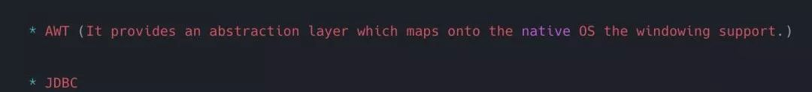
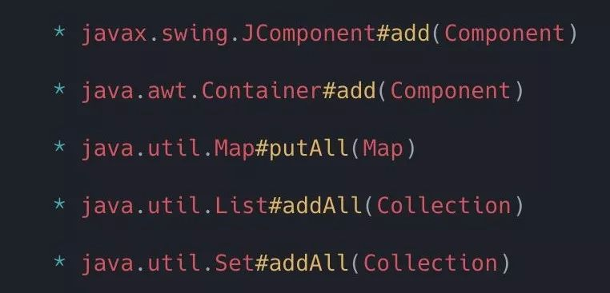
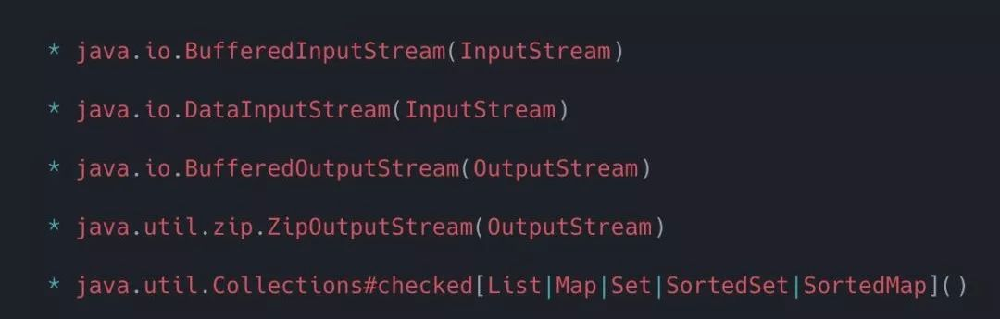
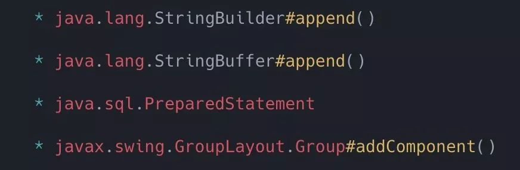
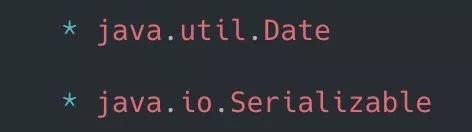
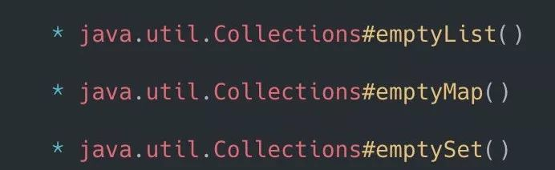
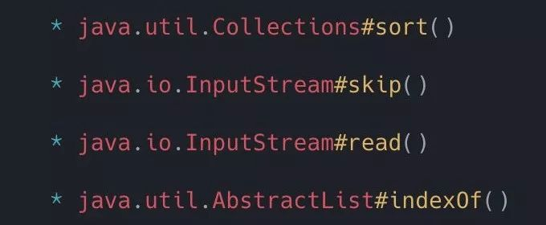
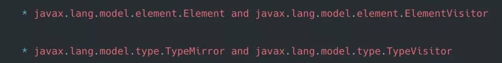

## 一、结构性模式：    

### 1、适配器模式： 

> 常用于将一个新接口适配旧接口

在我们业务代码中经常有新旧接口适配需求，可以采用该模式。

### 2、桥接模式： 

> 将抽象和抽象的具体实现进行解耦，这样可以使得抽象和抽象的具体实现可以独立进行变化。

：这个模式，其实我们每天都在用到，但是你可能却浑然不知。只要你用到面向接口编程，其实都是在用桥接模式。

### 3、组合模式 

> 让客户端看起来在处理单个对象和对象的组合是平等的，换句话说，某个类型的方法同时也接受自身类型作为参数。（So in other words methods on a type accepting the same type）

从上面那句英文我们就可以得知，组合模式常用于递归操作的优化上，比如每个公司都有个boss系统，都会有什么菜单的功能。比如一级菜单下有二级菜单，二级菜单又有三级菜单。删除一级菜单的时候需要不断删除子菜单，那么这个设计模式你可以试试。总之，凡是有级联操作的，你都可以尝试这个设计模式。

### 4、装饰者模式 

> 动态的给一个对象附加额外的功能，因此它也是子类化的一种替代方法。该设计模式在JDK中广泛运用，以下只是列举一小部分

这个模式使用就太广了，我们常用的AOP，既有动态代理，也有装饰者的味道。

### 5、门面模式 

> 为一组组件，接口，抽象或子系统提供简化的接口。

我们每天使用的SLFJ日志就是门面日志，比如我们使用Dubbo，向外提供的服务就尽量采用门面模式，然后服务在调用各种service做聚合。

### 6、享元模式 

> 使用缓存来减少对小对象的访问时间

只要用到了缓存，基本都是在使用享元模式。很多同学都说自己的项目太low了，都没有用到什么设计模式，这不是开玩笑吗，你用个map缓存几个对象，基本上都运用了享元的思想。

### 7、代理模式 

> 代理模式用于向较简单的对象代替创建复杂或耗时的对象。

代理模式用得很广泛，基本所有大家知道的开源框架，都用到了动态代理。

## 二、创建模式 

### 1、抽象工厂模式 

> 抽象工厂模式提供了一个协议来生成一系列的相关或者独立的对象，而不用指定具体对象的类型。它使得应用程序能够和使用的框架的具体实现进行解耦。在JDK和许多开源框架，比如Spring中随处可见，它们很容易被发现。任何用于创建对象但返回接口或抽象类的，就是抽象工厂模式了。（any method that is used to create an object but still returns a interface or abstract class）

从英文就可以得出，该模式可以与策略模式结合使用。

### 2、建造者模式 

> 用于通过定义一个类来简化复杂对象的创建，该类的目的是构建另一个类的实例。构建器模式还允许实现Fluent接口。

这个在我们业务代码中使用的场景太广泛了。比如订单系统大部分项目都有，订单对象就是一个复杂对象，我们就可以采用建造者模式来做。

### 3、工厂方法 

> 只是一个返回实际类型的方法。

这个属于大家都会的设计模式，不多过介绍。

### 4、原型模式 

> 使得类的实例能够生成自身的拷贝。如果创建一个对象的实例非常复杂且耗时时，就可以使用这种模式，而不重新创建一个新的实例，你可以拷贝一个对象并直接修改它。

这个你以为是冷门的设计模式，其实错了，这个是大热门的设计模式。比如我们业务代码，经常要各种DTO、BO、DO、VO转换，其实就可以参考原型设计模式的思想来做。

### 5、单例模式 

> 用来确保类只有一个实例。Joshua Bloch在Effetive Java中建议到，还有一种方法就是使用枚举。

在平时开发中，单例是我们用得最多的了，因为Spring的bean，默认就是单例级别的。单例属于大家基本都会的设计模式。

## 三、行为模式 

### 1、责任链 

> 通过把请求从一个对象传递到链条中下一个对象的方式来解除对象之间的耦合，直到请求被处理完毕。链中的对象是同一接口或抽象类的不同实现。

凡是带有`Filter`关键词的，基本都在用这个设计模式。在业务代码使用的场景实在是太多了，用到拦截器的地方基本都在用这个设计模式。

### 2、命令模式 

> 将命令包装在对象中，以便可以将其存储，传递到方法中，并像任何其他对象一样返回。

命令模式使用频率较高，和策略模式比较像，具体区别可以搜索一下。如果用过`Activiti`工作流引擎的朋友可以看一下里面的源码，很多地方都用到了命令模式。

### 3、解释器模式 

> 此模式通常描述为该语言定义语法并使用该语法来解释该格式的语句。（This pattern generally describes defining a grammar for that language and using that grammar to interpret statements in that format.）

这个比较冷门，肥朝没怎么用过，你用过的话可以留言告诉肥朝。

### 4、迭代器模式 

> 提供一个统一的方式来访问集合中的对象。

这个中间件和基础框架组的同学可能用得比较多，业务代码的话用得不多，不过JDK中的这种使用很经典，可以看看。

### 5、中介者模式 

> 通过使用一个中间对象来进行消息分发以及减少类之间的直接依赖。

看到这个描述不用我多说什么，业务代码使用的场景太多了。比如你们用MQ，其实就是在用中介者模式。所以肥朝一再强调，即使是每天CRUD，关注肥朝一起学习，也能给你的CRUD项目，加上美颜+滤镜（设计模式）的加强效果。

### 6、备忘录模式 

> 生成对象状态的一个快照，以便对象可以恢复原始状态而不用暴露自身的内容。比如Date对象通过自身内部的一个long值来实现备忘录模式。

这个在业务中使用得不多，据肥朝了解其中一种场景是，你要把数据丢到MQ，但是MQ暂时不可用，那么你把数据暂存到DB，后面再轮询丢到MQ。如果你有更好的场景，留言告诉肥朝。

### 7、空对象模式 

> 它允许您抽象空对象的处理。

这个业务代码用得不多，但是JDK中的这几个方法我们倒是挺常用的。

### 8、观察者模式 

> 用于为组件提供一种灵活地向感兴趣的接收者广播消息的方式。

我们业务代码一般是基于Zookeeper来做观察者的。基本上用到ZK的地方，都是在用观察者模式，比如分布式锁，比如服务发现等。

### 9、状态模式 

> 允许您在运行时根据内部状态轻松更改对象的行为。

这个在业务代码用得就太广泛了，我就不信你们系统还没有“状态”了。比如我们常见的订单状态或者各种XX状态，都可以用得上。

### 10、策略模式 

> 使用这个模式来将一组算法封装成一系列对象。通过调用这些对象可以灵活的改变程序的功能。

这个太高频了，常用于优化大量的`if-else`,如果这个设计模式都不会，出去不要说关注过肥朝的公众号！

### 11、模板方法模式 

> 让子类可以重写方法的一部分，而不是整个重写，你可以控制子类需要重写那些操作。

这个模式也是非常高频的模式。业务代码中经常遇到有很多相同的部分，我们可以做一个抽象类，子类来实现差异化，如果还不知道的，赶紧搜索一下，再次强调，非常高频。

### 12、访问者模式 

> 提供一个方便的可维护的方式来操作一组对象。它使得你在不改变操作的对象前提下，可以修改或者扩展对象的行为。

