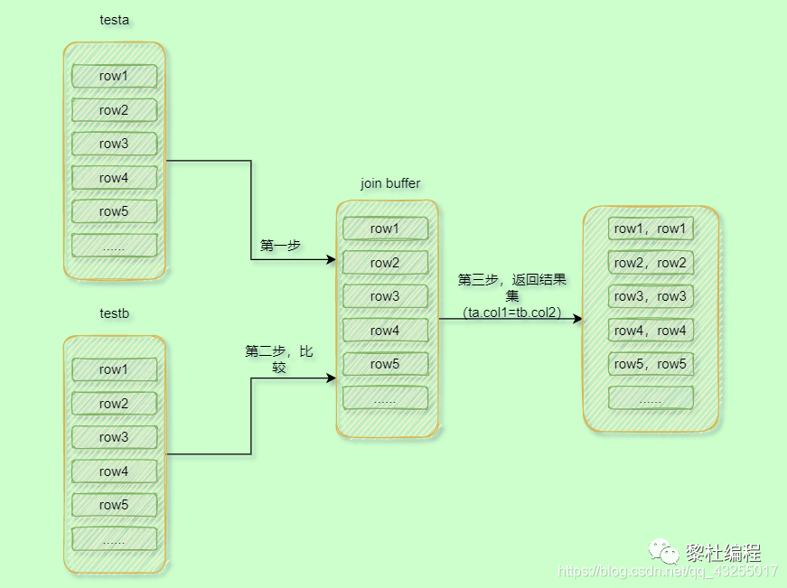

Mysql中的join原理。

join用法基本工作过的都会用，不管是left join、right join、inner join语法都是比较简单的。

但是，join的原理确实博大精深，对于一些传统it企业，几乎是一句sql走天下，join了五六个表，当数据量上来的时候，就会变得非常慢，索引对于掌握join的优化还是非常有必要的。

阿里的开发手册中规定join不能查过三个，有些互联网是明确规定不能使用join的的明文规定，那么在实际的场景中，我们真的不能使用join吗？我们就来详细的聊一聊。

Mysql的join主要涉及到三种算法，分别是Simple Nested-Loop Join、Block Nested-Loop Join、Index Nested-Loop Join，下面我们就来深入的了解这三种算法的原理、区别、效率。

首先，为了测试先准备两个表作为测试表，并且使用存储过程初始化一些测试数据，初始化的表结构sql如下所示：

```java
CREATE TABLE `testa` (
  `id` int(20) NOT NULL AUTO_INCREMENT COMMENT '活动主键',
  `col1` int(20) NOT NULL DEFAULT '0' COMMENT '测试字段1',
  `col2` int(20) NOT NULL DEFAULT '0' COMMENT '测试字段2',
  PRIMARY KEY (`id`),
  KEY `col1` (`idx_col1`)
)ENGINE=InnoDB AUTO_INCREMENT=782 DEFAULT CHARSET=utf8mb4 COMMENT='测试表1';


CREATE TABLE `testb` (
  `id` int(20) NOT NULL AUTO_INCREMENT COMMENT '活动主键',
  `col1` int(20) NOT NULL DEFAULT '0' COMMENT '测试字段1',
  `col2` int(20) NOT NULL DEFAULT '0' COMMENT '测试字段2',
  PRIMARY KEY (`id`),
  KEY `col1` (`idx_col1`)
) ENGINE=InnoDB AUTO_INCREMENT=782 DEFAULT CHARSET=utf8mb4 COMMENT='测试表2';
```

初始化数据：

```java
CREATE DEFINER = `root` @`localhost` PROCEDURE `init_data` () 

BEGIN
 DECLARE i INT;
 
 SET i = 1;
 WHILE ( i <= 100 ) DO
   INSERT INTO testa VALUES ( i, i, i );
  SET i = i + 1;
 END WHILE;
 
 SET i = 1;
 WHILE ( i <= 2000) DO
   INSERT INTO test2 VALUES ( i, i, i );
  SET i = i + 1;
 END WHILE;

END
```

分别初始化testa表为100条数据，testb为2000条数据

## Simple Nested-Loop Join 

首先，我们执行如下sql：

```java
select * from testa ta left join testb tb on (ta.col1=tb.col2);
```

Simple Nested-Loop Join是最简单也是最粗暴的join方法，上面的sql在testb 的col2字段是没有加索引的，所以当testa为驱动表，testb为被驱动表时，就会拿着testa的每一行，然后去testb的全表扫描，执行流程如下：

1.  从表testa中取出一行数据，记为ta。
2.  从ta中取出col1字段去testb中全表扫描查询。
3.  找到testb中满足情况的数据与ta组成结果集返回。
4.  重复执行1-3步骤，直到把testa表的所有数据都取完。

因此扫描的时间复杂度就是100\*2000=20W的行数，所以在被驱动表关联字段没有添加索引的时候效率就非常的低下。

假如testb是百万数据以上，那么扫描的时间复杂度就更恐怖了，但是在Mysql中没有使用这个算法，而是使用了另一种算法Block Nested-Loop Join，目的就是为了优化驱动表没有索引时的查询。

## Block Nested-Loop Join 

还是上面的sql，不过通过加explain关键字来查看这条sql的执行计划：

```java
explain select * from testa ta left join testb tb on (ta.col1=tb.col2);
```


可以看到testb依旧是全表扫描，并且在Extra字段中可以看到testb的Using join buffer（hash join）的字样，在rows中可以看到总扫描的行数是驱动表行数+被驱动表行数，那么这个算法与Simple Nested-Loop Join有什么区别呢？

Block Nested-Loop Join算法中引入了join buffer区域，而join buffer是一块内存区域，它的大小由join\_buffer\_size参数大小控制，默认大小是256k：


在执行上面的sql的时候，它会把testa表的数据全部加载到join buffer区域，因为join buffer是内存操作，因此相对于比上面的simple算法要高效，具体的执行流程如下：

1.  首先把testa表的所有数据都加在到join buffer里面，这里的所有数据是select后面的testa的字段，因为这里是select \*，所以就是加载所有的testa字段。
2.  然后遍历的取testb表中的每一行数据，并且与join buffer里面的数据济宁对比，符合条件的，就作为结果集返回。

具体的流程图如下所示：



所以，从上面的执行的步骤来看（假设驱动表的行数为N，被驱动表的行数据为M），Block Nested-Loop Join的扫描的行数还是驱动表+被驱动表行数（N+M），在内存中总的比较次数还是驱动表\*被驱动表行数（N\*M）

上面我们提到join buffer是一块内存区域，并且有自己的大小，要是join buffer的大小不足够容纳驱动表的数量级怎么办呢？

答案就是分段，你要是join buffer没办法容纳驱动表的所有数据，那么就不把所有的数据加载到join buffer里面，先加载一部分，后面再加载另一部分，比如：先加载testa中的80条数据，与testb比较完数据后，清空再加载testa后20条数据，再与testb进行比较。具体执行流程如下：

1.  先加载testa中的80条数据到join buffer
2.  然后一次遍历testb的所有数据，与join buffer里面的数据进行比较，符合条件的组成结果集。
3.  清空join buffer，再加载testa后面的20条数据。
4.  然后一次遍历testb的所有数据，与join buffer里面的数据进行比较，符合条件的组成结果集并返回。

执行流程图如下所示：


从上面的结果来看相对于比内存足够的join buffer来说，分段的join buffer多了一遍全表全表遍历testb，并且分的段数越多，多扫描驱动表的次数就越多。，性能就越差，所以在某一些场景下，适当的增大join buffer的值，是能够提高join的效率。

假如驱动表的行数是N，分段参数为K，被驱动表的行数是M，那么总的扫描行数还是N+K\*M，而内存比较的次数还是N\*M，没有变。

其中K段数与N的数据量有关，若是N的数据量越大，那么可能K被分成段数就越多，这样多次重复扫描的被驱动表的次数就越多。

所以在join buffer不够的情况小，驱动表是越小越好，能够减少K值，减少重复扫描被驱动表的次数。这也就是为什么提倡小表要作为驱动表的原因。

那么这里提到小表的概念，是不是就是数据量少的就是认为是小表呢？其实不然，小表的真正的还是是实际参与join的数据量，比如以下的两条sql：

```java
select * from testa ta left join testb tb on (ta.col1=tb.col2) where tb.id<=20;
select * from testb tb left join testa ta on (ta.col1=tb.col2) where tb.id<=20;
```

在第二条sql中，虽然testb驱动表数据量比较大，但是在where条件中实际参与join的行数也就是id小于等于20的数据，完全小于testa的数据量，所以这里选择以testb作为驱动表是更加的合适。

在实际的开发中Block Nested-Loop Join也是严禁被禁止出现的，严格要求关联条件建索引，所以性能最好的就是Index Nested-Loop Join算法。

## Index Nested-Loop Join 

当我们执行如下sql时：

```java
select * from testa ta left join testb tb on (ta.col1=tb.col1);
```


它的执行流程如下：

1.  首先取testa表的一行数据。
2.  使用上面的行数据的col1字段去testb表进行查询。
3.  在testb找到符合条件的数据行，并与testa的数据行组合作为结果集。
4.  重复执行1-3步骤，直到取完testa表的所有数据。

因为testb的col1字段是建立了索引，所以，当使用testa表的字段col1去testb查找的时候，testb走的是col1索引的b+树的搜索，时间复杂度近似log2M，并且因为是select\*，也就是要查找testb的所有字段，所以这里也涉及到回表查询，因此就变成了2\*log2M.

在这个过程中，testa表的扫描行数是全部，所以需要扫描100行，然后testa的每一行都与testb也是一一对应的，所以col1索引查询扫描的行数也是100行，所以总的扫描行数就是200行。

我们假设驱动表的数据行位N，被驱动表的数据行为M，那么近似的复杂度为：N+N\*2\*log M，因为驱动表的扫描行数就是N，然后被驱动表因为每一次都对应驱动表的一次，并且一次的时间复杂度就是近似2\*log M，所以被驱动表就是N\*2\*log M。

明显N的值对于N+N\*2\*log M的结果值影响更大，所以N越小越好，所以选择小表作为驱动表是最优选择。

在一些情况下的优化，假如join的驱动表所需要的字段很少（两个），可以建立联合索引来优化join查询，并且如果业务允许的话，可以通过冗余字段，减少join的个数提高查询的效率。 