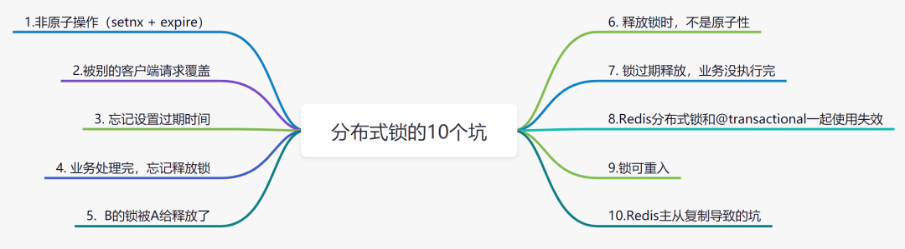
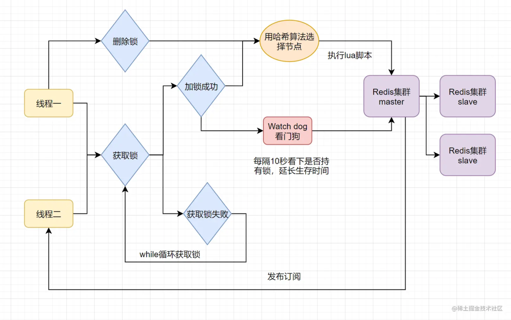
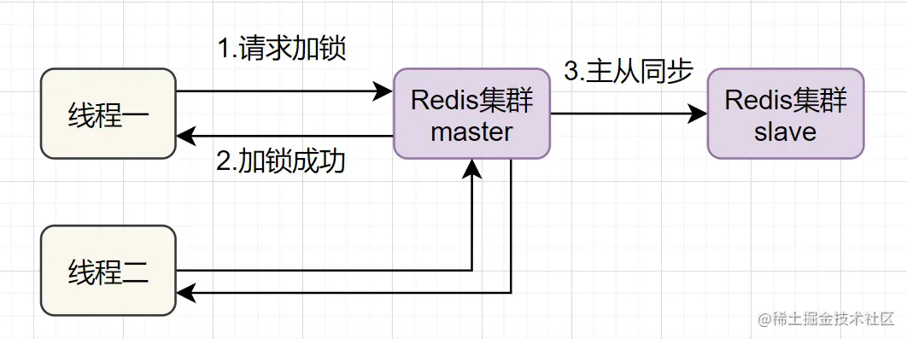

日常开发中，经常会碰到秒杀抢购等业务。为了避免并发请求造成的库存超卖等问题，我们一般会用到`Redis`分布式锁。但是使用`Redis`分布式锁，很容易踩坑哦~ 本文田螺哥将给大家分析阐述，`Redis`分布式锁的`10`个坑~



## 1. 非原子操作（setnx + expire） 

一说到实现`Redis`的分布式锁，很多小伙伴马上就会想到`setnx+ expire`命令。也就是说，先用`setnx`来抢锁，如果抢到之后，再用`expire`给锁设置一个过期时间。

伪代码如下：

```java
if（jedis.setnx(lock_key,lock_value) == 1）{ //加锁
    jedis.expire(lock_key，timeout）; //设置过期时间
    doBusiness //业务逻辑处理
}
```

这块代码是有坑的，因为`setnx`和`expire`两个命令是分开写的，并不是原子操作！如果刚要执行完`setnx`加锁，正要执行`expire`设置过期时间时，进程`crash`或者要重启维护了，那么这个锁就“长生不老”了，别的线程永远获取不到锁啦。

## 2.被别的客户端请求覆盖（ setnx + value为过期时间） 

为了解决：发生异常时，锁得不到释放的问题。有小伙伴提出，可以把过期时间放到`setnx`的`value`里面。如果加锁失败，再拿出`value`值和当前系统时间校验一下是否过期即可。伪代码实现如下：

```java
long expireTime = System.currentTimeMillis() + timeout; //系统时间+设置的超时时间
String expireTimeStr = String.valueOf(expireTime); //转化为String字符串

// 如果当前锁不存在，返回加锁成功
if (jedis.setnx(lock_key, expireTimeStr) == 1) {
        return true;
} 

// 如果锁已经存在，获取锁的过期时间
String oldExpireTimreStr = jedis.get(lock_key);

// 如果获取到的老的预期过期时间，小于系统当前时间，表示已经过期了
if (oldExpireTimreStr != null && Long.parseLong(oldExpireTimreStr) < System.currentTimeMillis()) {

     //锁已过期，获取上一个锁的过期时间，并设置现在锁的过期时间（不了解redis的getSet命令的小伙伴，可以去官网看下哈）
    String oldValueStr = jedis.getSet(lock_key, expireTimeStr);
    
    if (oldValueStr != null && oldValueStr.equals(oldExpireTimreStr)) {
      //考虑多线程并发的情况，只有一个线程的设置值和当前值相同，它才可以加锁
      return true;
    }
}
        
//其他情况，均返回加锁失败
return false;
}
```

这种实现的方案，也是有坑的：如果锁过期的时候，并发多个客户端同时请求过来，都执行`jedis.getSet()`，最终只能有一个客户端加锁成功，但是该客户端锁的过期时间，可能被别的客户端覆盖。

## 3. 忘记设置过期时间 

之前`review`代码的时候，看到这样实现的分布式锁，伪代码：

```java
try{
  if(jedis.setnx(lock_key,lock_value) == 1){//加锁
     doBusiness //业务逻辑处理
     return true; //加锁成功，处理完业务逻辑返回
  }
  return false; //加锁失败
} finally {
    unlock(lockKey);- //释放锁
} 
```

这块有什么问题呢？是的，忘记设置过期时间了。如果程序在运行期间，机器突然挂了，代码层面没有走到`finally`代码块，即在宕机前，锁并没有被删除掉，这样的话，就没办法保证解锁，所以这里需要给`lockKey`加一个过期时间。注意哈，使用分布式锁，一定要设置过期时间哈。

## 4. 业务处理完，忘记释放锁 

很多小伙伴，会使用`Redis`的`set`指令扩展参数来实现分布式锁。

```java
set指令扩展参数：SET key value[EX seconds][PX milliseconds][NX|XX]

- NX :表示key不存在的时候，才能set成功，也即保证只有第一个客户端请求才能获得锁，
  而其他客户端请求只能等其释放锁，才能获取。
- EX seconds :设定key的过期时间，时间单位是秒。
- PX milliseconds: 设定key的过期时间，单位为毫秒
- XX: 仅当key存在时设置值
```

小伙伴会写出如下伪代码：

```java
if(jedis.set(lockKey, requestId, "NX", "PX", expireTime)==1){ //加锁
   doBusiness //业务逻辑处理
   return true; //加锁成功，处理完业务逻辑返回
}
return false; //加锁失败
```

这块伪代码，初看觉得没啥问题，但是细想，不太对呀。因为忘记释放锁了！如果每次加锁成功，都要等到超时时间才释放锁，是会有问题的。这样程序不高效，应当每次处理完业务逻辑，都要释放锁。

正例如下：

```java
try{
  if(jedis.set(lockKey, requestId, "NX", "PX", expireTime)==1){//加锁
     doBusiness //业务逻辑处理
     return true; //加锁成功，处理完业务逻辑返回
  }
  return false; //加锁失败
} finally {
    unlock(lockKey);- //释放锁
}  
```

## 5. B的锁被A给释放了 

我们来看下这块伪代码：

```java
try{
  if(jedis.set(lockKey, requestId, "NX", "PX",expireTime)==1){//加锁
     doBusiness //业务逻辑处理
     return true; //加锁成功，处理完业务逻辑返回
  }
  return false; //加锁失败
} finally {
    unlock(lockKey); //释放锁
}  
```

大家觉得会有哪些坑呢？

> 假设在这样的并发场景下：`A、B`两个线程来尝试给Redis的key`lockKey`加锁，`A`线程先拿到锁（假如锁超时时间是`3`秒后过期）。如果线程`A`执行的业务逻辑很耗时，超过了`3`秒还是没有执行完。这时候，`Redis`会自动释放`lockKey`锁。刚好这时，线程`B`过来了，它就能抢到锁了，开始执行它的业务逻辑，恰好这时，线程`A`执行完逻辑，去释放锁的时候，它就把`B`的锁给释放掉了。

正确的方式应该是，在用`set`扩展参数加锁时，放多一个这个线程请求的唯一标记，比如`requestId`，然后释放锁的时候，判断一下是不是刚刚的请求。

```java
try{
  if(jedis.set(lockKey, requestId, "NX", "PX",expireTime)==1){//加锁
     doBusiness //业务逻辑处理
     return true; //加锁成功，处理完业务逻辑返回
  }
  return false; //加锁失败
} finally {
    if (requestId.equals(jedis.get(lockKey))) { //判断一下是不是自己的requestId
      unlock(lockKey);//释放锁
    }   
}  
```

## 6. 释放锁时，不是原子性 

以上的这块代码，还是有坑：

```java
   if (requestId.equals(jedis.get(lockKey))) { //判断一下是不是自己的requestId
      unlock(lockKey);//释放锁
    }   
```

因为判断是不是当前线程加的锁和释放锁不是一个原子操作。如果调用`unlock(lockKey)`释放锁的时候，锁已经过期，所以这把锁已经可能已经不属于当前客户端，会解除他人加的锁。

因此，这个坑就是：`判断和删除`是两个操作，不是原子的，有一致性问题。`释放锁必须保证原子性`，可以使用`Redis+Lua`脚本来完成，类似`Lua`脚本如下：

```java
if redis.call('get',KEYS[1]) == ARGV[1] then 
   return redis.call('del',KEYS[1]) 
else
   return 0
end;  
```

## 7. 锁过期释放，业务没执行完 

加锁后，如果超时了，`Redis`会自动释放清除锁，这样有可能业务还没处理完，锁就提前释放了。怎么办呢？

有些小伙伴认为，稍微把锁过期时间设置长一些就可以啦。其实我们设想一下，是否可以给获得锁的线程，开启一个定时守护线程，每隔一段时间检查锁是否还存在，存在则对锁的过期时间延长，防止锁过期提前释放。

当前开源框架Redisson解决了这个问题。我们一起来看下`Redisson`底层原理图吧：



只要线程`一`加锁成功，就会启动一个`watch dog`看门狗，它是一个后台线程，会每隔`10`秒检查一下，如果线程一还持有锁，那么就会不断的延长锁`key`的生存时间。因此，`Redisson`就是使用`Redisson`解决了锁过期释放，业务没执行完问题。

## 8. Redis分布式锁和@transactional一起使用失效 

大家看下这块伪代码:

```java
@Transactional
public void updateDB(int lockKey) {
  boolean lockFlag = redisLock.lock(lockKey);
  if (!lockFlag) {
    throw new RuntimeException(“请稍后再试”);
  }
   doBusiness //业务逻辑处理
   redisLock.unlock(lockKey);
}
```

在事务中,使用了`Redis`分布式锁.这个方法一旦执行,事务生效，接着就`Redis`分布式锁生效，代码执行完后,先释放`Redis`分布式锁,然后再提交事务数据，最后事务结束。在这个过程中,事务没有提交之前,分布式锁已经被释放，导致分布式锁失效

这是因为:

> `spring`的`Aop`，会在`updateDB`方法之前开启事务，之后再加锁，当锁住的代码执行完成后，再提交事务，因此锁住的代码块执行是在事务之内执行的，可以推断在代码块执行完时，事务还未提交，锁已经被释放，此时其他线程拿到锁之后进行锁住的代码块，读取的库存数据不是最新的。

正确的实现方法,可以在`updateDB`方法之前就上锁，即还没有开事务之前就加锁，那么就可以保证线程的安全性.

## 9.锁可重入 

前面讨论的`Redis`分布式锁，都是不可重入的。

> 所谓的不可重入，就是当前线程执行某个方法已经获取了该锁，那么在方法中尝试再次获取锁时，会阻塞，不可以再次获得锁。同一个人拿一个锁 ，只能拿一次不能同时拿`2`次。

不可重入的分布式锁的话，是可以满足绝大多数的业务场景。但是有时候一些业务场景，我们还是需要可重入的分布式锁，大家实现分布式锁的过程中，需要注意一下，你当前的业务场景是否需要可重入的分布式锁。

`Redis`只要解决这两个问题，就能实现重入锁了：

 *  怎么保存当前持有的线程
 *  怎么维护加锁次数（即重入了多少次）

实现一个可重入的分布式锁，我们可以参考`JDK`的`ReentrantLock`的设计思想。实际上，可以直接使用`Redisson`框架，它是支持可重入锁的。

## 10.Redis主从复制导致的坑 

实现`Redis`分布式锁的话，要注意`Redis`主从复制的坑。因为`Redis`一般都是集群部署的：



如果线程一在`Redis`的`master`节点上拿到了锁，但是加锁的`key`还没同步到`slave`节点。恰好这时，`master`节点发生故障，一个`slave`节点就会升级为`master`节点。线程二就可以获取同个`key`的锁啦，但线程一也已经拿到锁了，锁的安全性就没了。

为了解决这个问题，Redis作者 antirez提出一种高级的分布式锁算法：`Redlock`。`Redlock`核心思想是这样的：

> 搞多个Redis master部署，以保证它们不会同时宕掉。并且这些master节点是完全相互独立的，相互之间不存在数据同步。同时，需要确保在这多个master实例上，是与在Redis单实例，使用相同方法来获取和释放锁。

我们假设当前有`5`个`Redis master`节点，在`5`台服务器上面运行这些`Redis`实例。


RedLock的实现步骤如下:

1.  获取当前时间，以毫秒为单位。
2.  按顺序向 `5`个 `master`节点请求加锁。客户端设置网络连接和响应超时时间，并且超时时间要小于锁的失效时间。（假设锁自动失效时间为 `10`秒，则超时时间一般在 `5-50`毫秒之间,我们就假设超时时间是 `50ms`吧）。如果超时，跳过该 `master`节点，尽快去尝试下一个 `master`节点。
3.  客户端使用当前时间减去开始获取锁时间（即步骤 `1`记录的时间），得到获取锁使用的时间。当且仅当超过一半（ `N/2+1`，这里是 `5/2+1=3`个节点）的 `Redis master`节点都获得锁，并且使用的时间小于锁失效时间时，锁才算获取成功。（如上图， `10s> 30ms+40ms+50ms+4m0s+50ms`）
4.  如果取到了锁， `key`的真正有效时间就变啦，需要减去获取锁所使用的时间。
5.  如果获取锁失败（没有在至少 `N/2+1个master`实例取到锁，有或者获取锁时间已经超过了有效时间），客户端要在所有的 `master`节点上解锁（即便有些 `master`节点根本就没有加锁成功，也需要解锁，以防止有些漏网之鱼）。

简化下步骤就是：

 *  按顺序向5个master节点请求加锁
 *  根据设置的超时时间来判断，是不是要跳过该master节点。
 *  如果大于等于3个节点加锁成功，并且使用的时间小于锁的有效期，即可认定加锁成功啦。
 *  如果获取锁失败，解锁！

