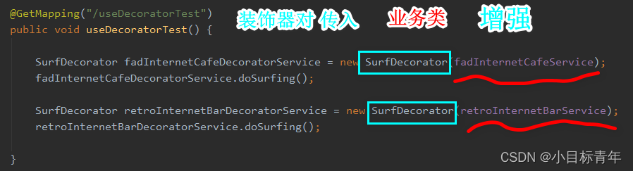
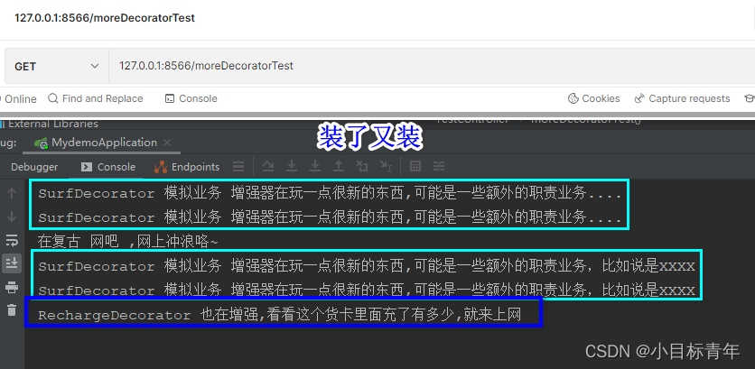

## 装饰器模式（Decorator Pattern） 也称为包装模式(Wrapper Pattern) 是指在不改变原有对象的基础之上，将功能附加到对象上，提供了比继承更有弹性的替代方案(扩展原有对象的功能)，属于结构型模式。 
## 装饰器模式的核心是功能扩展，使用装饰器模式可以透明且动态地扩展类的功能。    
## 大白话一点： 
## 有点像是 组合， 就是 我不动原先的业务东西，但是 又想给这个业务东西 加点额外的职责东西。 
 *  非入侵的。
 *  可拼凑的。
### 实战开搞 
##### 实例简述预热 

`ISurfTheInternetService` 网上冲浪冲浪业务 接口 interface

 *  `FadInternetCafe implements ISurfTheInternetService` 时尚网咖 实现冲浪业务接口，实现重写提供 网上冲浪方法
 *  `RetroInternetBar implements ISurfTheInternetService` 复古网吧 实现冲浪业务接口，实现重写提供 网上冲浪方法

然后在这个原有的冲浪业务下， 不做代码入侵， 我们想给网上冲浪冲浪业务加一点额外的职责，比如XXX,XXX啥的xxx业务。

于是乎，我们开始玩装饰器设计模式

 *  `SurfDecorator implements ISurfTheInternetService` 网上冲浪装饰器

怎么玩的？看代码， 后面还会说怎么多层装饰 。

事不宜迟。

##### ① ISurfTheInternetService.java 网上冲浪冲浪业务 接口 

```java
/**
 * @Author: JCccc
 * @Date: 2022-10-07 15:18
 * @Description: 网上冲浪
 */
public interface ISurfTheInternetService {
 
    /**
     * 冲起来
     */
    void doSurfing();
}
```

##### ② FadInternetCafe.java 时尚网咖业务实现类 

```java
import com.example.mydemo.service.ISurfTheInternetService;
import org.springframework.stereotype.Service;
 
/**
 * @Author: JCccc
 * @Date: 2022-10-07 15:21
 * @Description: 时尚 网咖
 */
@Service("fadInternetCafeService")
public class FadInternetCafe implements ISurfTheInternetService {
    
    @Override
    public void doSurfing() {
 
        System.out.println("在时尚 网咖 ,网上冲浪咯~");
 
    }
}
```

##### ③ RetroInternetBar.java 复古网吧业务实现类 

```java
import com.example.mydemo.service.ISurfTheInternetService;
import org.springframework.stereotype.Service;
 
/**
 * @Author: JCccc
 * @Date: 2022-10-07 15:21
 * @Description: 复古 网吧
 */
@Service("retroInternetBarService")
public class RetroInternetBar implements ISurfTheInternetService {
 
    @Override
    public void doSurfing() {
        System.out.println("在复古 网吧 ,网上冲浪咯~");
    }
}
```

先到这， 写个controller方法，模拟平时搬砖真实场景 ：

```java
@Autowired
@Qualifier("fadInternetCafeService")
ISurfTheInternetService fadInternetCafeService;


@Autowired
@Qualifier("retroInternetBarService")
ISurfTheInternetService retroInternetBarService;


@GetMapping("/doTest")
public void doTest() {

    fadInternetCafeService.doSurfing();
    retroInternetBarService.doSurfing();
}
```

可以看到调用效果是这样的：

  


然后。

然后在这个原有的冲浪业务下， 不做代码入侵， 我们想给网上冲浪冲浪业务加一点额外的职责，比如XXX,XXX啥的xxx业务。

##### ④ SurfDecorator.java 网上冲浪装饰器 

```java
/**
 * @Author: JCccc
 * @Date: 2022-10-07 15:29
 * @Description:
 */
public class SurfDecorator implements  ISurfTheInternetService {
 
    /**
     * 内部维护一个冲浪接口类
     */
    private ISurfTheInternetService surfTheInternetService;
 
    /**
     * 构造方法 把传入的 类 赋值给内部类
     * @param surfTheInternetService
     */
    public SurfDecorator(ISurfTheInternetService surfTheInternetService) {
        this.surfTheInternetService = surfTheInternetService;
    }
 
    /**
     * 增强的网上冲浪方法
     */
    @Override
    public void doSurfing() {
 
        System.out.println("SurfDecorator 模拟业务 增强器在玩一点很新的东西,可能是一些额外的职责业务....");
        //增强
        surfTheInternetService.doSurfing();
        System.out.println("SurfDecorator 模拟业务 增强器在玩一点很新的东西,可能是一些额外的职责业务，比如说是XXXX");
    }
    
}
```

然后我们通过装饰器去 调用方法，实现增强职责：

```java
@GetMapping("/useDecoratorTest")
public void useDecoratorTest() {

    SurfDecorator fadInternetCafeDecoratorService = new SurfDecorator(fadInternetCafeService);
    fadInternetCafeDecoratorService.doSurfing();

    SurfDecorator retroInternetBarDecoratorService = new SurfDecorator(retroInternetBarService);
    retroInternetBarDecoratorService.doSurfing();
    
}
```

  


可以看到效果， 它装起来了 ：

  


然后，如果我们想多层装饰， 也就是 ，针对不同也网上冲浪业务实现类，想装一层又一层，

比如 时尚网卡的网上冲浪业务， 网咖老板比较腹黑，不仅仅需要做 A 增强业务，

还想看看每个来上网的人到底是不是有钱人，所以想检测一下卡里面的钱有多少，好安排一些‘优质服务’。

##### ⑤ 又一层装饰器 RechargeDecorator.java ： 

##### ps ：它继承了基本的网上冲浪装饰器， 然后增强了自己的检测充值金额业务方法。 

```java
/**
 * @Author: JCccc
 * @Date: 2022-10-07 15:29
 * @Description:
 */
public class RechargeDecorator extends SurfDecorator{
 
    public RechargeDecorator(ISurfTheInternetService surfTheInternetService) {
        super(surfTheInternetService);
    }
 
    @Override
    public void doSurfing() {
        super.doSurfing();
        checkRecharge();
    }
    private void checkRecharge(){
        System.out.print("RechargeDecorator 也在增强,看看这个货卡里面充了有多少,就来上网");
    }
    
}
```

然后看看 我们怎么玩 多层装饰：

```java
@GetMapping("/moreDecoratorTest")
public void moreDecoratorTest() {

    //先装一哈
    SurfDecorator retroInternetBarDecoratorService = new SurfDecorator(retroInternetBarService);
    //再包装一哈
    RechargeDecorator rechargeDecorator = new RechargeDecorator(retroInternetBarDecoratorService);
    rechargeDecorator.doSurfing();

}
```

  


可以看到效果，它装起来了，又装起来了：

  


