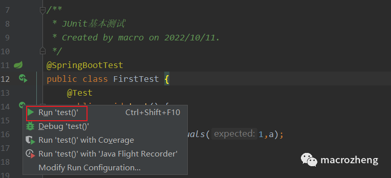
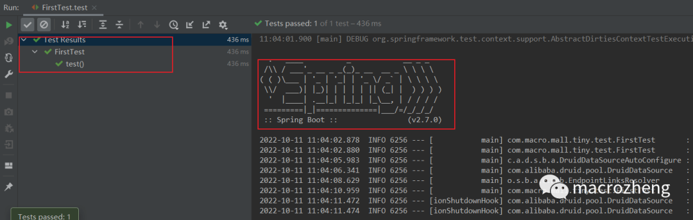
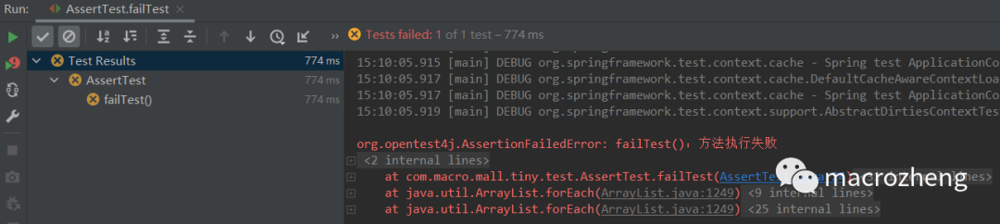
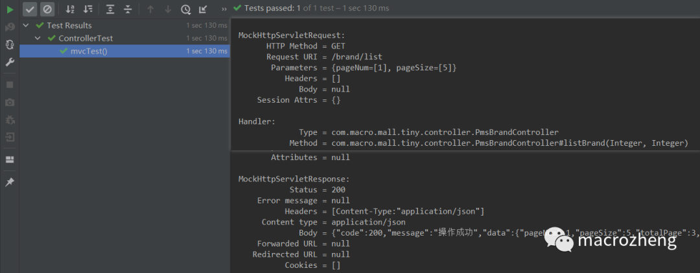

## JUnit 简介 

JUnit是一款Java语言的单元测试框架，目前大多数Java开发环境都已经支持它了。JUnit测试也就是所谓的白盒测试，在程序员知道程序内部逻辑的基础上进行的测试，使用JUnit能让我们快速地完成单元测试。Spring Boot Test将JUnit和其他测试框架结合起来，提供了便捷高效的测试手段，目前Spring Boot 2.7版本采用的是JUnit 5。

## 常用注解 

> 在使用Spring Boot Test之前，我们先来了解下它常用的注解，这对使用它很有帮助，具体参考下表即可！

<table> 
 <thead> 
  <tr> 
   <th>注解</th> 
   <th>作用</th> 
  </tr> 
 </thead> 
 <tbody> 
  <tr> 
   <td>@SpringBootTest</td> 
   <td>用于指定测试类启用Spring Boot Test，默认会提供Mock环境</td> 
  </tr> 
  <tr> 
   <td>@ExtendWith</td> 
   <td>如果只想启用Spring环境进行简单测试，不想启用Spring Boot环境，可以配置扩展为：SpringExtension</td> 
  </tr> 
  <tr> 
   <td>@Test</td> 
   <td>指定方法为测试方法</td> 
  </tr> 
  <tr> 
   <td>@TestMethodOrder</td> 
   <td>用于配置测试类中方法的执行顺序策略，配置为OrderAnnotation时，按@Order顺序执行</td> 
  </tr> 
  <tr> 
   <td>@Order</td> 
   <td>用于配置方法的执行顺序，数字越低执行顺序越高</td> 
  </tr> 
  <tr> 
   <td>@DisplayName</td> 
   <td>用于指定测试类和测试方法的别名</td> 
  </tr> 
  <tr> 
   <td>@BeforeAll</td> 
   <td>在测试类的所有测试方法前执行一次，可用于全局初始化</td> 
  </tr> 
  <tr> 
   <td>@AfterAll</td> 
   <td>在测试类的所有测试方法后执行一次，可用于全局销毁资源</td> 
  </tr> 
  <tr> 
   <td>@BeforeEach</td> 
   <td>在测试类的每个测试方法前都执行一次</td> 
  </tr> 
  <tr> 
   <td>@AfterEach</td> 
   <td>在测试类的每个测试方法后都执行一次</td> 
  </tr> 
  <tr> 
   <td>@Disabled</td> 
   <td>禁用测试方法</td> 
  </tr> 
  <tr> 
   <td>@RepeatedTest</td> 
   <td>指定测试方法重复执行</td> 
  </tr> 
  <tr> 
   <td>@ParameterizedTest</td> 
   <td>指定参数化测试方法，类似重复执行，从@ValueSource中获取参数</td> 
  </tr> 
  <tr> 
   <td>@ValueSource</td> 
   <td>用于参数化测试指定参数</td> 
  </tr> 
  <tr> 
   <td>@AutoConfigureMockMvc</td> 
   <td>启用MockMvc的自动配置，可用于测试接口</td> 
  </tr> 
 </tbody> 
</table>


## 基本使用 

> 下面我们来聊聊这些注解的基本使用，通过它们可以实现一些基本的单元测试。

### 集成Spring Boot Test 

如果你想在项目中集成Spring Boot Test的话，需要先在`pom.xml`中添加如下依赖。

```java
<dependency>
    <groupId>org.springframework.boot</groupId>
    <artifactId>spring-boot-starter-test</artifactId>
    <scope>test</scope>
</dependency>
```

### 最简单的测试 

 *  我们先来一个最简单的单元测试，使用 `@SpringBootTest`注解启用单元测试，使用 `@Test`指定测试方法，使用 `Assertions`类的方法来断言结果是否符合预期，具体代码如下。

```java
/**
 * JUnit基本测试
 * Created by macro on 2022/10/11.
 */
@SpringBootTest
public class FirstTest {
    @Test
    public void test() {
        int a=1;
        Assertions.assertEquals(1,a);
    }
}
```

 *  然后点击测试方法左侧按钮即可进行测试。



 *  执行完成后我们在IDEA的执行窗口中就可以看到方法测试通过了，由于使用 `@SpringBootTest`启用了Spring Boot环境，日志中会输出Spring Boot的banner。



### 指定测试方法顺序 

 *  我们可以通过 `@TestMethodOrder`注解和 `@Order`注解来指定所有测试方法的执行顺序，具体代码如下。

```java
/**
 * JUnit指定方法测试顺序
 * Created by macro on 2022/10/10.
 */
@ExtendWith(SpringExtension.class)
@TestMethodOrder(MethodOrderer.OrderAnnotation.class)
public class MethodOrderTest {

    private static final Logger LOGGER = LoggerFactory.getLogger(MethodOrderTest.class);

    @Test
    @Order(1)
    @DisplayName("order为1的方法")
    void lowOrder(){
        LOGGER.info("lowOrder method");
    }

    @Test
    @Order(10)
    @DisplayName("order为10的方法")
    void highOrder(){
        LOGGER.info("highOrder method");
    }
}
```

 *  点击类左侧测试按钮，可以直接运行该类中的所有测试方法。


 *  这里由于我们使用了 `@DisplayName`注解给测试方法取了个别名，而且我们使用了 `@ExtendWith`指定了运行环境为Spring而不是Spring Boot，所以日志中不会出现Spring Boot的banner，执行速度也更快。


### 生命周期测试 

 *  我们还可以通过JUnit 5的生命周期注解来执行测试方法，比如在 `@BeforeAll`注解指定的方法中做全局初始化，在 `@AfterAll`注解指定的方法中做资源的销毁，具体代码如下。

```java
/**
 * JUnit生命周期测试
 * Created by macro on 2022/10/10.
 */
@ExtendWith(SpringExtension.class)
public class LifecycleTest {

    private static final Logger LOGGER = LoggerFactory.getLogger(LifecycleTest.class);

    @BeforeAll
    static void allInit(){
        LOGGER.info("allInit()：在所有方法前执行，只执行一次");
    }

    @BeforeEach
    void eachInit(){
        LOGGER.info("eachInit()：在测试方法前执行，每个测试方法前都执行");
    }

    @Test
    void successTest() {
        LOGGER.info("successTest()：方法执行成功");
    }

    @AfterEach
    void eachDown(){
        LOGGER.info("eachDown()：在测试方法后执行，每个测试方法后都执行");
    }

    @AfterAll
    static void allDown(){
        LOGGER.info("allDown()：在测试方法后执行，每个测试方法后都执行");
    }

}
```

 *  测试完成后，控制台输出日志如下。


### 断言的使用 

> 我们可以通过`Assertions`类中提供的断言API来断言测试结果。

 *  例如我们可以使用 `fail`方法直接断言方法执行失败并输出提示信息。

```java
/**
 * JUnit断言测试
 * Created by macro on 2022/10/11.
 */
@ExtendWith(SpringExtension.class)
public class AssertTest {

    @Test
    void failTest() {
        Assertions.fail("failTest()：方法执行失败");
    }
}
```

 *  测试方法执行后会直接抛出异常信息。



 *  还可以通过 `assertTrue`、 `assertNull`、 `assertEquals`这类方法来断言结果是否符合预期。

```java
/**
 * JUnit断言测试
 * Created by macro on 2022/10/11.
 */
@ExtendWith(SpringExtension.class)
public class AssertTest {

    @Test
    void failTest() {
        Assertions.fail("failTest()：方法执行失败");
    }

    @Test
    void trueTest(){
        Assertions.assertTrue(1==1);
    }

    @Test
    void trueFalse(){
        Assertions.assertFalse(3<=2);
    }

    @Test
    void nullTest(){
        String str = null;
        Assertions.assertNull(str);
    }

    @Test
    void notNullTest(){
        String str = "test";
        Assertions.assertNotNull(str);
    }

    @Test
    void equalsTest(){
        String str1 = "test";
        String str2 = "test";
        Assertions.assertEquals(str1,str2);
    }

    @Test
    void notEqualsTest(){
        String str1 = "test";
        String str2 = "test";
        Assertions.assertNotEquals(str1,str2);
    }
}
```

 *  也可以使用 `assertThrows`方法来断言方法中抛出的异常。

```java
/**
 * JUnit断言测试
 * Created by macro on 2022/10/11.
 */
@ExtendWith(SpringExtension.class)
public class AssertTest {

    private static final Logger LOGGER = LoggerFactory.getLogger(LifecycleTest.class);
    @Test
    void throwsTest(){
        Assertions.assertThrows(NullPointerException.class,()->{
            String str = null;
            LOGGER.info(str.toLowerCase());
        });
    }
}
```

 *  还可通过 `assertTimeout`方法断言方法的执行时间。

```java
/**
 * JUnit断言测试
 * Created by macro on 2022/10/11.
 */
@ExtendWith(SpringExtension.class)
public class AssertTest {
    @Test
    void timeoutTest(){
        Assertions.assertTimeout(Duration.ofMillis(1000),()->{
            long sleepTime = 2000;
            ThreadUtil.sleep(sleepTime);
            LOGGER.info("timeoutTest():休眠{}毫秒",sleepTime);
        });
    }
}
```

 *  或者通过 `assertAll`方法将几个断言结合起来使用， `Assertions`类中提供的工具方法很多，具体可以参考它的代码。

```java
/**
 * JUnit断言测试
 * Created by macro on 2022/10/11.
 */
@ExtendWith(SpringExtension.class)
public class AssertTest {
    @Test
    void assertAllTest(){
        Assertions.assertAll(()->{
            trueTest();
        },()->{
            nullTest();
        },()->{
            equalsTest();
        });
    }
}
```

### 其他测试 

 *  Spring Boot Test除了上述测试功能，还可以使用 `@Disabled`来禁用某个测试方法。

```java
/**
 * JUnit其他测试
 * Created by macro on 2022/10/10.
 */
@ExtendWith(SpringExtension.class)
public class OtherTest {
    @Test
    @Disabled("用于测试@Disabled注解")
    void disabledTest() {
        LOGGER.info("disabledTest()：方法被执行");
    }
}
```

 *  也可以使用 `@RepeatedTest`来实现循环测试。

```java
/**
 * JUnit其他测试
 * Created by macro on 2022/10/10.
 */
@ExtendWith(SpringExtension.class)
public class OtherTest {

    private static final Logger LOGGER = LoggerFactory.getLogger(LifecycleTest.class);
    private static int count = 0;

    @RepeatedTest(3)
    void repeatedTest() {
        count++;
        LOGGER.info("repeatedTest()：重复执行第{}次",count);
    }
}
```

 *  还可以通过 `@ParameterizedTest`来进行参数化测试。

```java
/**
 * JUnit其他测试
 * Created by macro on 2022/10/10.
 */
@ExtendWith(SpringExtension.class)
public class OtherTest {

    private static final Logger LOGGER = LoggerFactory.getLogger(LifecycleTest.class);

    @ParameterizedTest
    @ValueSource(ints = {1,2,3})
    public void parameterizedTest(int a){
        LOGGER.info("parameterizedTest()：a={}",a);
    }
}
```

 *  运行以上测试方法后，具体测试结果如下。


## 项目实战 

> 上面介绍了Spring Boot Test的基本使用，下面我们结合项目来使用下它。

### Dao层测试 

如果我们的项目需要对数据访问层Dao中的方法进行测试的话，直接注入Mapper接口，在测试方法中直接调用即可，这里对根据ID查询品牌的Mapper方法进行测试。

```java
/**
 * Dao层方法测试
 * Created by macro on 2022/10/11.
 */
@SpringBootTest
public class MapperTest {

    private static final Logger LOGGER = LoggerFactory.getLogger(MapperTest.class);

    @Autowired
    private PmsBrandMapper brandMapper;

    @Test
    void testGetById(){
        long id = 6;
        PmsBrand pmsBrand = brandMapper.selectByPrimaryKey(id);
        LOGGER.info("brand name:{}",pmsBrand.getName());
        Assertions.assertEquals("小米",pmsBrand.getName());
    }
}
```

## Service层测试 

对业务层Service中的方法测试也是一样的，直接注入Service接口，在测试方法中直接调用即可，这里对根据ID查询品牌的Service方法进行测试。

```java
/**
 * Service层方法测试
 * Created by macro on 2022/10/11.
 */
@SpringBootTest
public class ServiceTest {
    private static final Logger LOGGER = LoggerFactory.getLogger(ServiceTest.class);
    @Autowired
    private PmsBrandService brandService;

    @Test
    void testGetById(){
        long id = 6;
        PmsBrand pmsBrand = brandService.getBrand(id);
        LOGGER.info("brand name:{}",pmsBrand.getName());
        Assertions.assertEquals("小米",pmsBrand.getName());
    }
}
```

## Controller层测试 

对于Controller层方法进行测试，有时我们需要模拟请求，使用MockMvc即可，这里模拟测试下分页查询品牌列表的接口。

```java
/**
 * Controller层方法测试
 * Created by macro on 2022/10/11.
 */
@SpringBootTest
@AutoConfigureMockMvc
public class ControllerTest {

    @Autowired
    private MockMvc mockMvc;

    @Test
    void mvcTest() throws Exception{
        //模拟发送一个请求访问分页查询品牌列表的接口
        mockMvc.perform(MockMvcRequestBuilders.get("/brand/list") //设置请求地址
                .param("pageNum","1") //设置请求参数
                .param("pageSize","5"))
                .andExpect(MockMvcResultMatchers.status().isOk()) //断言返回状态码为200
                .andDo(MockMvcResultHandlers.print()) //在控制台打印日志
                .andReturn(); //返回请求结果
    }
}
```

由于我们选择了在控制台输出日志，控制台将输出如下信息。



## 总结 

今天带大家体验了一把Spring Boot Test，作为Spring Boot官方测试框架，确实功能很强大。由于其主要基于JUnit 5，和JUnit 5的用法基本一致。使用它进行单元测试，无需启动整个项目，更快更好用！

## 参考资料 

JUnit 5官方文档：https://junit.org/junit5/docs/current/user-guide/