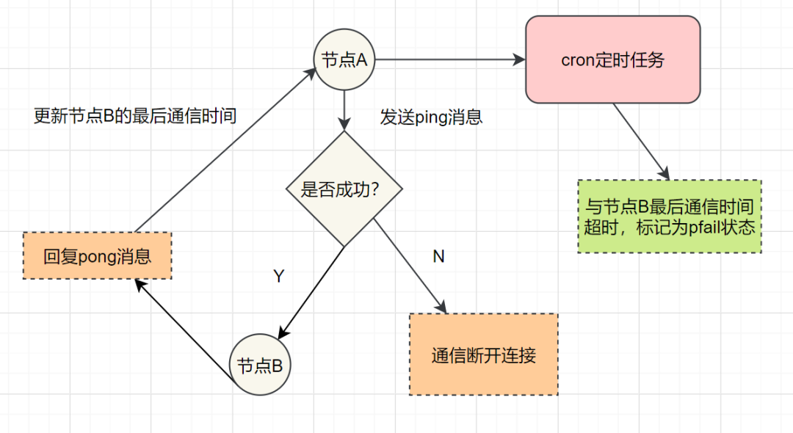
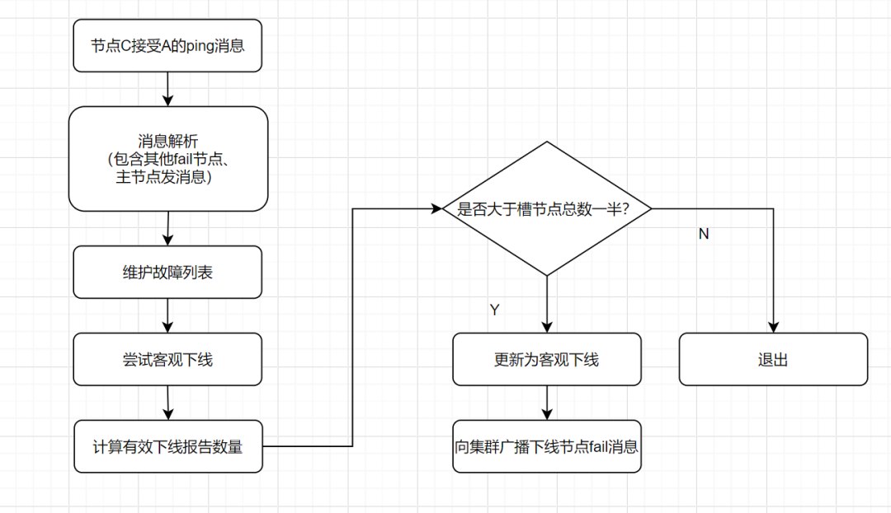

我们在项目中使用redis，肯定不会是单点部署Redis服务的。因为单点部署一旦宕机，就不可用了。为了实现高可用，通常的做法是，将数据库复制多个副本以部署在不同的服务器上，其中一台挂了也可以继续提供服务。Redis 实现高可用有三种部署模式：主从模式，哨兵模式，集群模式。

## 1.主从模式 

主从模式中，Redis部署了多台机器，有主节点，负责读写操作，有从节点，只负责读操作。从节点的数据来自主节点，实现原理就是主从复制机制

主从复制包括全量复制，增量复制两种。一般当slave第一次启动连接master，或者认为是第一次连接，就采用全量复制，全量复制流程如下：

 *  1.slave发送sync命令到master。
 *  2.master接收到SYNC命令后，执行bgsave命令，生成RDB全量文件。
 *  3.master使用缓冲区，记录RDB快照生成期间的所有写命令。
 *  4.master执行完bgsave后，向所有slave发送RDB快照文件。
 *  5.slave收到RDB快照文件后，载入、解析收到的快照。
 *  6.master使用缓冲区，记录RDB同步期间生成的所有写的命令。
 *  7.master快照发送完毕后，开始向slave发送缓冲区中的写命令;
 *  8.salve接受命令请求，并执行来自master缓冲区的写命令

redis2.8版本之后，已经使用psync来替代sync，因为sync命令非常消耗系统资源，psync的效率更高。

slave与master全量同步之后，master上的数据，如果再次发生更新，就会触发增量复制。

当master节点发生数据增减时，就会触发`replicationFeedSalves()`函数，接下来在 Master节点上调用的每一个命令会使用`replicationFeedSlaves()`来同步到Slave节点。执行此函数之前呢，master节点会判断用户执行的命令是否有数据更新，如果有数据更新的话，并且slave节点不为空，就会执行此函数。这个函数作用就是：把用户执行的命令发送到所有的slave节点，让slave节点执行。流程如下：

## 2.哨兵模式 

主从模式中，一旦主节点由于故障不能提供服务，需要人工将从节点晋升为主节点，同时还要通知应用方更新主节点地址。显然，多数业务场景都不能接受这种故障处理方式。Redis从2.8开始正式提供了Redis Sentinel（哨兵）架构来解决这个问题。

哨兵模式，由一个或多个Sentinel实例组成的Sentinel系统，它可以监视所有的Redis主节点和从节点，并在被监视的主节点进入下线状态时，自动将下线主服务器属下的某个从节点升级为新的主节点。但是呢，一个哨兵进程对Redis节点进行监控，就可能会出现问题（单点问题），因此，可以使用多个哨兵来进行监控Redis节点，并且各个哨兵之间还会进行监控。

 Sentinel哨兵模式

简单来说，哨兵模式就三个作用：

 *  发送命令，等待Redis服务器（包括主服务器和从服务器）返回监控其运行状态；
 *  哨兵监测到主节点宕机，会自动将从节点切换成主节点，然后通过发布订阅模式通知其他的从节点，修改配置文件，让它们切换主机；
 *  哨兵之间还会相互监控，从而达到高可用。

故障切换的过程是怎样的呢

> 假设主服务器宕机，哨兵1先检测到这个结果，系统并不会马上进行 failover 过程，仅仅是哨兵1主观的认为主服务器不可用，这个现象成为主观下线。当后面的哨兵也检测到主服务器不可用，并且数量达到一定值时，那么哨兵之间就会进行一次投票，投票的结果由一个哨兵发起，进行 failover 操作。切换成功后，就会通过发布订阅模式，让各个哨兵把自己监控的从服务器实现切换主机，这个过程称为客观下线。这样对于客户端而言，一切都是透明的。

哨兵的工作模式如下：

1.  每个Sentinel以每秒钟一次的频率向它所知的Master，Slave以及其他Sentinel实例发送一个 PING命令。
2.  如果一个实例（instance）距离最后一次有效回复 PING 命令的时间超过 down-after-milliseconds 选项所指定的值， 则这个实例会被 Sentinel标记为主观下线。
3.  如果一个Master被标记为主观下线，则正在监视这个Master的所有 Sentinel 要以每秒一次的频率确认Master的确进入了主观下线状态。
4.  当有足够数量的 Sentinel（大于等于配置文件指定的值）在指定的时间范围内确认Master的确进入了主观下线状态， 则Master会被标记为客观下线。
5.  在一般情况下， 每个 Sentinel 会以每10秒一次的频率向它已知的所有Master，Slave发送 INFO 命令。
6.  当Master被 Sentinel 标记为客观下线时，Sentinel 向下线的 Master 的所有 Slave 发送 INFO 命令的频率会从 10 秒一次改为每秒一次
7.  若没有足够数量的 Sentinel同意Master已经下线， Master的客观下线状态就会被移除；若Master 重新向 Sentinel 的 PING 命令返回有效回复， Master 的主观下线状态就会被移除。

## 3. Cluster集群模式 

哨兵模式基于主从模式，实现读写分离，它还可以自动切换，系统可用性更高。但是它每个节点存储的数据是一样的，浪费内存，并且不好在线扩容。因此，Cluster集群应运而生，它在Redis3.0加入的，实现了Redis的分布式存储。对数据进行分片，也就是说每台Redis节点上存储不同的内容，来解决在线扩容的问题。并且，它也提供复制和故障转移的功能。

### 3.1 Cluster集群节点的通讯 

一个Redis集群由多个节点组成，各个节点之间是怎么通信的呢？通过Gossip协议！

Redis Cluster集群通过Gossip协议进行通信，节点之前不断交换信息，交换的信息内容包括节点出现故障、新节点加入、主从节点变更信息、slot信息等等。常用的Gossip消息分为4种，分别是：ping、pong、meet、fail。

>  *  meet消息：通知新节点加入。消息发送者通知接收者加入到当前集群，meet消息通信正常完成后，接收节点会加入到集群中并进行周期性的ping、pong消息交换。
>  *  ping消息：集群内交换最频繁的消息，集群内每个节点每秒向多个其他节点发送ping消息，用于检测节点是否在线和交换彼此状态信息。
>  *  pong消息：当接收到ping、meet消息时，作为响应消息回复给发送方确认消息正常通信。pong消息内部封装了自身状态数据。节点也可以向集群内广播自身的pong消息来通知整个集群对自身状态进行更新。
>  *  fail消息：当节点判定集群内另一个节点下线时，会向集群内广播一个fail消息，其他节点接收到fail消息之后把对应节点更新为下线状态。

特别的，每个节点是通过集群总线(cluster bus) 与其他的节点进行通信的。通讯时，使用特殊的端口号，即对外服务端口号加10000。例如如果某个node的端口号是6379，那么它与其它nodes通信的端口号是 16379。nodes 之间的通信采用特殊的二进制协议。

### 3.2 Hash Slot插槽算法 

既然是分布式存储，Cluster集群使用的分布式算法是一致性Hash嘛？并不是，而是Hash Slot插槽算法。

插槽算法把整个数据库被分为16384个slot（槽），每个进入Redis的键值对，根据key进行散列，分配到这16384插槽中的一个。使用的哈希映射也比较简单，用CRC16算法计算出一个16 位的值，再对16384取模。数据库中的每个键都属于这16384个槽的其中一个，集群中的每个节点都可以处理这16384个槽。

集群中的每个节点负责一部分的hash槽，比如当前集群有A、B、C个节点，每个节点上的哈希槽数 =16384/3，那么就有：

 *  节点A负责0~5460号哈希槽
 *  节点B负责5461~10922号哈希槽
 *  节点C负责10923~16383号哈希槽

### 3.3 Redis Cluster集群 

Redis Cluster集群中，需要确保16384个槽对应的node都正常工作，如果某个node出现故障，它负责的slot也会失效，整个集群将不能工作。

因此为了保证高可用，Cluster集群引入了主从复制，一个主节点对应一个或者多个从节点。当其它主节点 ping 一个主节点 A 时，如果半数以上的主节点与 A 通信超时，那么认为主节点 A 宕机了。如果主节点宕机时，就会启用从节点。

在Redis的每一个节点上，都有两个玩意，一个是插槽（slot），它的取值范围是0~16383。另外一个是cluster，可以理解为一个集群管理的插件。当我们存取的key到达时，Redis 会根据CRC16算法得出一个16 bit的值，然后把结果对16384取模。酱紫每个key都会对应一个编号在 0~16383 之间的哈希槽，通过这个值，去找到对应的插槽所对应的节点，然后直接自动跳转到这个对应的节点上进行存取操作。

虽然数据是分开存储在不同节点上的，但是对客户端来说，整个集群Cluster，被看做一个整体。客户端端连接任意一个node，看起来跟操作单实例的Redis一样。当客户端操作的key没有被分配到正确的node节点时，Redis会返回转向指令，最后指向正确的node，这就有点像浏览器页面的302 重定向跳转。

### 3.4 故障转移 

Redis集群实现了高可用，当集群内节点出现故障时，通过故障转移，以保证集群正常对外提供服务。

redis集群通过ping/pong消息，实现故障发现。这个环境包括主观下线和客观下线。

主观下线： 某个节点认为另一个节点不可用，即下线状态，这个状态并不是最终的故障判定，只能代表一个节点的意见，可能存在误判情况。

 主观下线

客观下线： 指标记一个节点真正的下线，集群内多个节点都认为该节点不可用，从而达成共识的结果。如果是持有槽的主节点故障，需要为该节点进行故障转移。

 *  假如节点A标记节点B为主观下线，一段时间后，节点A通过消息把节点B的状态发到其它节点，当节点C接受到消息并解析出消息体时，如果发现节点B的pfail状态时，会触发客观下线流程；
 *  当下线为主节点时，此时Redis Cluster集群为统计持有槽的主节点投票，看投票数是否达到一半，当下线报告统计数大于一半时，被标记为 客观下线状态。

流程如下：

 客观下线

故障恢复：故障发现后，如果下线节点的是主节点，则需要在它的从节点中选一个替换它，以保证集群的高可用。流程如下：

 *  资格检查：检查从节点是否具备替换故障主节点的条件。
 *  准备选举时间：资格检查通过后，更新触发故障选举时间。
 *  发起选举：到了故障选举时间，进行选举。
 *  选举投票：只有持有槽的 主节点才有票，从节点收集到足够的选票（大于一半），触发 替换主节点操作
